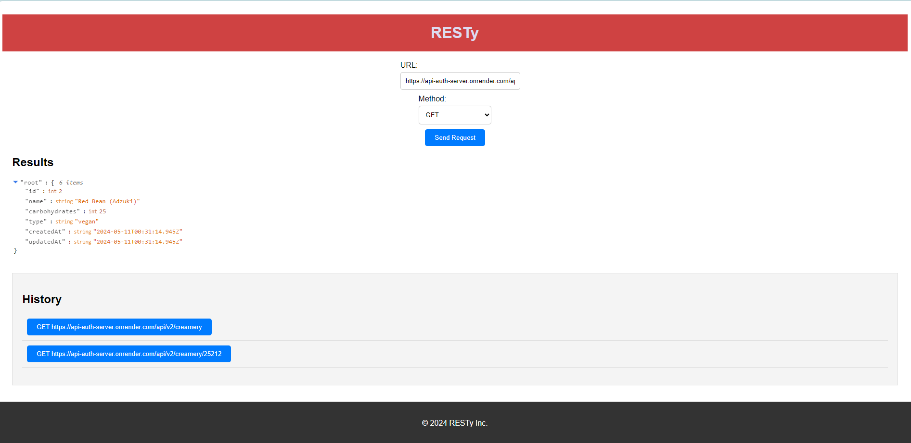

# resty

# Day 1: Base
## UML diagram:


### GET with pokemon URL Localhost:


# Day 2: State
Localhost: 


polish: 

# DAy 3: Effect-Hook
1. make tests use effectHook();
2. stretch: REST all work
3. make the website prettier

polish: 


### Mock site testing: 
1. Install JSON Server:
```npm install -g json-server```
terminal install 
2. create a `db.json` file
3. `json-server --watch db.json --port 3001`

#### Get request:

#### Post:  and 

#### Put:  and 

#### Delete:  and 

### Day 4: 
use API render site to do REST: 


## Credit
- CHATGPT helped with implemention of the tests for this project! 